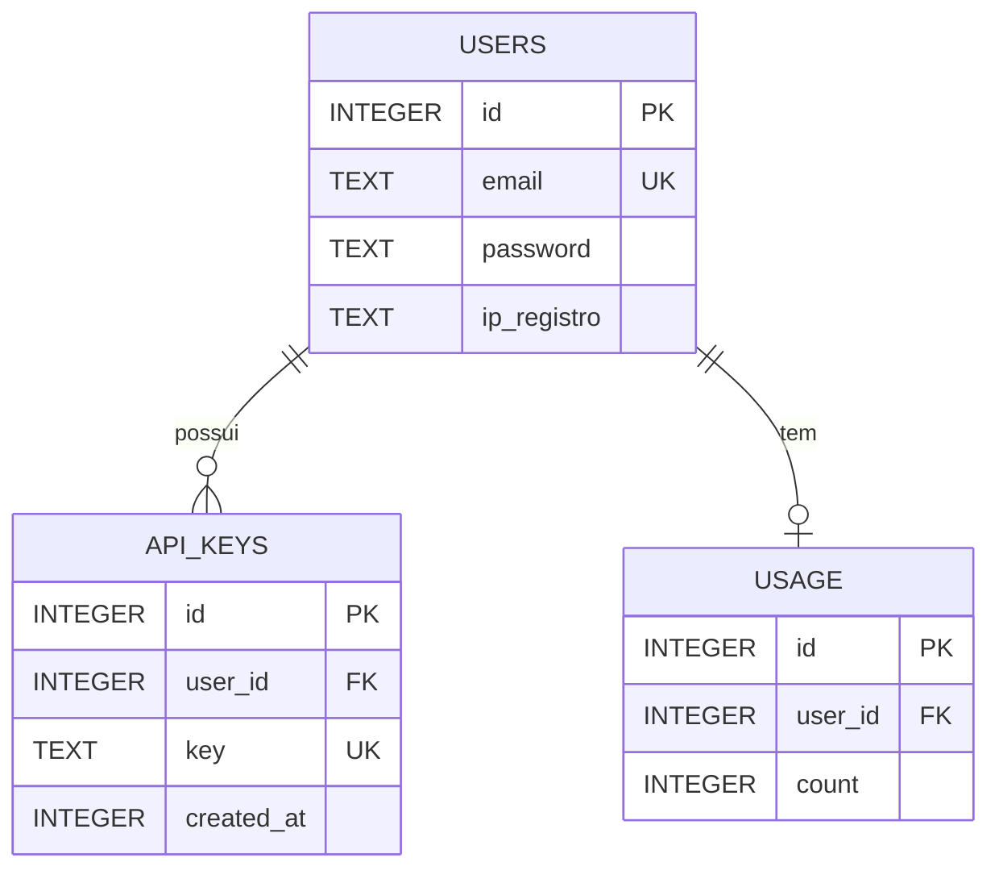

# Levantamento de Requisitos - Wiredia API

[Voltar para README](./README.md)

---

## 1. Visão Geral

A Wiredia API é uma API RESTful desenvolvida em Node.js/Express que fornece serviços utilitários para processamento de dados, conversões, validações e integrações com serviços externos. O sistema inclui autenticação baseada em JWT, gerenciamento de API keys, painel administrativo e sistema completo de logging.

**URL Base**: `https://api.wiredia.dev`  
**Porta**: 3000  
**Ambiente**: Produção (Ubuntu Server)

---

## Índice

- [1. Visão Geral](#1-visão-geral)
- [2. Requisitos Funcionais](#2-requisitos-funcionais)
- [3. Requisitos Não Funcionais](#3-requisitos-não-funcionais)
- [4. Arquitetura e Tecnologias](#4-arquitetura-e-tecnologias)
- [5. Variáveis de Ambiente](#5-variáveis-de-ambiente)
- [6. Endpoints da API](#6-endpoints-da-api)
- [7. Segurança Implementada](#7-segurança-implementada)
- [8. Deploy e Produção](#8-deploy-e-produção)

---

## 2. Requisitos Funcionais

### 2.1 Autenticação e Autorização

**Registro de Usuário**
- Sistema permite registro com email e senha
- Email único no sistema
- Senha mínima de 8 caracteres, criptografada com bcrypt (10 rounds)
- IP de registro capturado e armazenado
- Validação de formato de email e comprimento de senha
- Rota: `POST /auth/register`
- Interface: `/registrar`

**Login de Usuário**
- Autenticação com email e senha
- Geração de token JWT com validade de 7 dias
- Opção "Lembrar de mim" para manter sessão
- Redirecionamento automático baseado em perfil (admin/usuário)
- Rota: `POST /auth/login`
- Interface: `/login`

**Verificação de Sessão**
- Middleware `verifyUser` para rotas protegidas
- Validação de assinatura e expiração do token
- Retorno de erro 401 para tokens inválidos/expirados

**Controle de Acesso Admin**
- Lista de emails admin configurável via variável de ambiente (`ADMIN_EMAILS`)
- Middleware `verifyAdmin` para rotas administrativas
- Redirecionamento automático de admins para `/admin` após login
- Redirecionamento de não-admins para `/panel` ao tentar acessar `/admin`

### 2.2 Gerenciamento de API Keys

**Geração de API Keys**
- Usuários autenticados podem gerar múltiplas API keys
- Chave aleatória de 48 caracteres hexadecimais
- Armazenamento com timestamp de criação
- Inicialização automática de contador de uso
- Rota: `POST /keys/generate-key`

**Visualização de API Keys**
- Listagem de todas as chaves do usuário
- Exibição de data de criação formatada
- Rota: `GET /keys/stats`

**Validação de API Key**
- Middleware `verifyApiKey` para rotas da API
- Validação via header `x-api-key`
- Incremento automático de contador de uso
- Captura de email e API key para logging

### 2.3 Endpoints da API

**Hash de Texto**
- Calcular hash de uma string usando algoritmo especificado
- Suporte a múltiplos algoritmos (MD5, SHA1, SHA256, SHA512, etc.)
- Algoritmo padrão: SHA256
- Rota: `GET /hash?text={texto}&algorithm={algoritmo}`
- Resposta: `{ algorithm: string, hash: string }`

**Comparação de Hash**
- Comparar texto com hash para verificar correspondência
- Rota: `POST /compare`
- Body: `{ text: string, hash: string, algorithm?: string }`

**Codificação/Decodificação Base64**
- Converter texto para Base64 e vice-versa
- Rotas: `POST /base64/encode`, `POST /base64/decode`

**Validação e Formatação de CPF**
- Validar e formatar CPF brasileiro
- Formatação padrão: `XXX.XXX.XXX-XX`
- Rota: `POST /cpf`

**Validação de CEP**
- Validar estrutura de CEP brasileiro (8 dígitos)
- Identificação de região
- Formatação: `XXXXX-XXX`
- Rota: `POST /cep`

**Codificação/Decodificação Hexadecimal**
- Converter texto para hexadecimal e vice-versa
- Rotas: `POST /hex/encode`, `POST /hex/decode`

**Conversão de Timestamp**
- Converter timestamp Unix para múltiplos formatos (ISO 8601, pt-BR, UTC)
- Rota: `GET /timestamp?ts={timestamp}`

**Integração Last.fm**
- Buscar última música tocada de um usuário do Last.fm
- Requer API key do Last.fm configurada
- Rota: `GET /lastfm/:username`

**Conversão de Moedas**
- Converter valores de moedas fiat e criptomoedas para BRL
- Rota: `GET /valor/:moeda`

### 2.4 Interface do Usuário

**Página de Registro** (`/registrar`)
- Formulário com campos email e senha
- Validação client-side (mínimo 8 caracteres)
- Redirecionamento para login após registro
- Arquivo: `public/register.html`

**Página de Login** (`/login`)
- Formulário com email e senha
- Checkbox "Lembrar de mim"
- Redirecionamento baseado em perfil (admin/usuário)
- Arquivo: `public/login.html`

**Painel do Usuário** (`/panel`)
- Exibição de requisições pessoais e total da API
- Geração de API keys
- Listagem de todas as API keys do usuário
- Requer autenticação JWT
- Arquivo: `public/panel.html`

**Painel Administrativo** (`/admin`)
- Listagem de últimas requisições (logs)
- Listagem de todos os usuários (ID, Email, IP de Registro, Requisições, API Keys)
- Proteção contra acesso não autorizado
- Requer autenticação JWT e permissão de admin
- Arquivo: `public/admin.html`

**Redirecionamento de Raiz**
- `GET /` redireciona para `/registrar`

### 2.5 Logging e Monitoramento

**Sistema de Logging**
- Arquivo por dia: `logs/YYYY-MM-DD.log`
- Formato JSON por linha
- Campos: data, hora, ip, method, path, status, duration_ms, user_email, api_key
- Captura de IP real mesmo atrás de proxy

**Estatísticas de Uso**
- Contador por usuário na tabela `usage`
- Incremento automático a cada requisição com API key válida
- Rota: `GET /keys/stats`

**Visualização de Logs (Admin)**
- Limite configurável (padrão: 100, máximo: 1000)
- Proteção contra path traversal
- Rota: `GET /admin/logs?limit={numero}`

**Visualização de Usuários (Admin)**
- Listagem com email, IP de registro, contagem de requisições
- Exibição de todas as API keys de cada usuário
- Rota: `GET /admin/users`

### 2.6 Segurança

**Rate Limiting**
- Limite: 100 requisições por minuto por IP
- Janela deslizante de 60 segundos
- Resposta 429 quando excedido

**Validação de Entrada**
- Validação de tipos e formatos
- Sanitização XSS no frontend
- Prevenção de path traversal

**Criptografia de Senhas**
- Hash bcrypt com 10 rounds
- Nunca armazenar senhas em texto plano

**Proteção de Rotas Admin**
- Verificação dupla (JWT + email na lista de admins)
- Redirecionamento automático no frontend
- Resposta 403 no backend para não-autorizados

---

## 3. Requisitos Não Funcionais

**Performance**
- Endpoints devem responder em menos de 2 segundos
- Sistema deve suportar múltiplas requisições concorrentes

**Segurança**
- Dados sensíveis armazenados de forma segura
- Variáveis de ambiente para secrets
- HTTPS em produção (configurado no servidor)

**Confiabilidade**
- Tratamento adequado de erros
- Respostas HTTP apropriadas
- Sistema disponível 24/7 (PM2)

**Manutenibilidade**
- Código modular e organizado
- TypeScript para type safety
- Documentação atualizada

**Usabilidade**
- Interfaces intuitivas e responsivas

---

## 4. Arquitetura e Tecnologias

**Stack Tecnológico**

Backend:
- Node.js (v18+)
- Express.js v5.1.0
- TypeScript 5.9.3
- SQLite (better-sqlite3 v12.4.6)
- JWT (jsonwebtoken v9.0.2)
- bcryptjs v3.0.3
- node-fetch v2.7.0
- cheerio v1.1.2
- dotenv v17.2.3

Frontend:
- HTML5 com JavaScript vanilla
- CSS3 inline
- LocalStorage para persistência de token

Ferramentas:
- TypeScript Compiler (tsc)
- ts-node-dev v2.0.0 (dev)
- PM2 (produção)

**Estrutura de Diretórios**

```
wiredia/
├── main.ts              # Servidor Express principal
├── auth.ts              # Rotas de autenticação
├── apikey.ts            # Gerenciamento de API keys
├── database.ts          # Configuração do SQLite
├── package.json
├── tsconfig.json
├── .env                 # Variáveis de ambiente
├── .env.example
├── utils/               # Utilitários
│   ├── hash.ts
│   ├── compare.ts
│   ├── base64.ts
│   ├── hex.ts
│   ├── cpf.ts
│   ├── cep.ts
│   ├── time.ts
│   ├── valor.ts
│   └── lastfm.ts
├── public/              # Arquivos estáticos
│   ├── login.html
│   ├── register.html
│   ├── panel.html
│   └── admin.html
├── logs/                # Logs diários
├── dist/                # Código compilado
└── app.db               # Banco de dados SQLite
```

**Fluxo de Requisição**

1. Requisição HTTP → Express
2. Middleware de Logging → Registra requisição
3. Middleware de Rate Limiting → Verifica limite por IP
4. Roteamento:
   - Rotas públicas → Processamento direto
   - Rotas protegidas → Verificação JWT
   - Rotas da API → Verificação API Key
5. Processamento → Utilitários específicos
6. Resposta JSON → Cliente

**Banco de Dados**

**Diagrama Entidade Relacionamento**



**Estrutura das Tabelas**

Tabela `users`:
- id (INTEGER PRIMARY KEY)
- email (TEXT UNIQUE)
- password (TEXT)
- ip_registro (TEXT)

Tabela `api_keys`:
- id (INTEGER PRIMARY KEY)
- user_id (INTEGER, FOREIGN KEY -> users.id)
- key (TEXT UNIQUE)
- created_at (INTEGER)

Tabela `usage`:
- id (INTEGER PRIMARY KEY)
- user_id (INTEGER, FOREIGN KEY -> users.id)
- count (INTEGER DEFAULT 0)

---

## 5. Variáveis de Ambiente

Arquivo `.env` na raiz do projeto:

```env
JWT_SECRET=<chave_aleatória_forte>
LASTFM_API_KEY=<sua_chave_lastfm>
ADMIN_EMAILS=seuemaildeadmin@wiredia.dev
```

- `.env` não deve ser versionado
- `.env.example` deve ser versionado como template
- JWT_SECRET deve ser uma string aleatória forte (mínimo 32 caracteres)

---

## 6. Endpoints da API

**Rotas Públicas (Sem Autenticação)**
- GET `/` → Redireciona para `/registrar`
- GET `/login` → Serve página de login
- GET `/registrar` → Serve página de registro
- GET `/panel` → Serve painel do usuário
- GET `/admin` → Serve painel administrativo
- POST `/auth/register` → Registro de novo usuário
- POST `/auth/login` → Login de usuário

**Rotas Protegidas (JWT)**
- POST `/keys/generate-key` → Gerar nova API key (Usuário autenticado)
- GET `/keys/stats` → Estatísticas do usuário (Usuário autenticado)
- GET `/admin/users` → Listar usuários (Admin)
- GET `/admin/logs` → Listar logs (Admin)

**Rotas da API (API Key)**
- GET `/hash` → Calcular hash
- POST `/compare` → Comparar hash
- POST `/base64/encode` → Codificar Base64
- POST `/base64/decode` → Decodificar Base64
- POST `/cpf` → Validar CPF
- POST `/cep` → Validar CEP
- POST `/hex/encode` → Codificar hexadecimal
- POST `/hex/decode` → Decodificar hexadecimal
- GET `/timestamp` → Converter timestamp
- GET `/lastfm/:username` → Última música Last.fm
- GET `/valor/:moeda` → Converter moeda

Todas as rotas da API requerem header `x-api-key`.

---

## 7. Segurança Implementada

- JWT com expiração de 7 dias
- Verificação de token em rotas protegidas
- Controle de acesso baseado em roles (admin/usuário)
- Validação de API keys em todas as rotas da API
- Senhas criptografadas com bcrypt (10 rounds)
- API keys armazenadas de forma segura
- Variáveis sensíveis em `.env`
- IP de registro capturado e armazenado
- Validação de entrada em todos os endpoints
- Sanitização XSS no frontend
- Prevenção de path traversal
- Rate limiting: 100 requisições por minuto por IP
- Logs detalhados de todas as requisições
- Captura de IP real (mesmo atrás de proxy)

---

## 8. Deploy e Produção

**Compilação**
```bash
npm run build
```

**Execução**
```bash
npm run build  # Compila TypeScript
npm start      # Executa em produção
```

**PM2**
```bash
pm2 start dist/main.js --name wiredia-api ## em realidade de producao eu to rodando isso com uma screen, o pm2 so funciona quando quer
pm2 logs wiredia-api
pm2 restart wiredia-api
```

**Configuração do Servidor**
- Trust Proxy configurado para capturar IP real atrás de proxy/nginx
- Porta 3000
- HTTPS configurado no nível de proxy reverso (Nginx)


